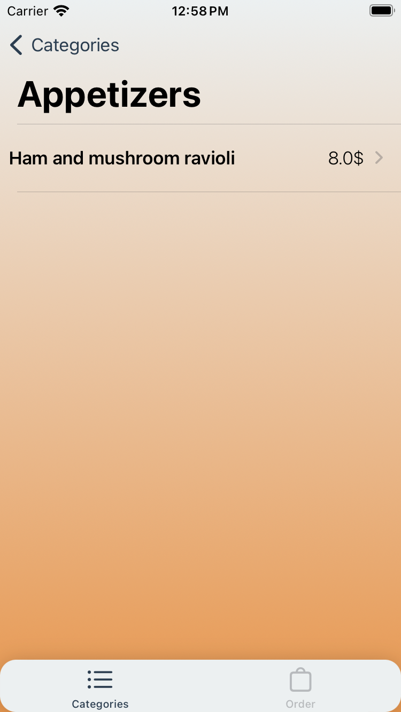
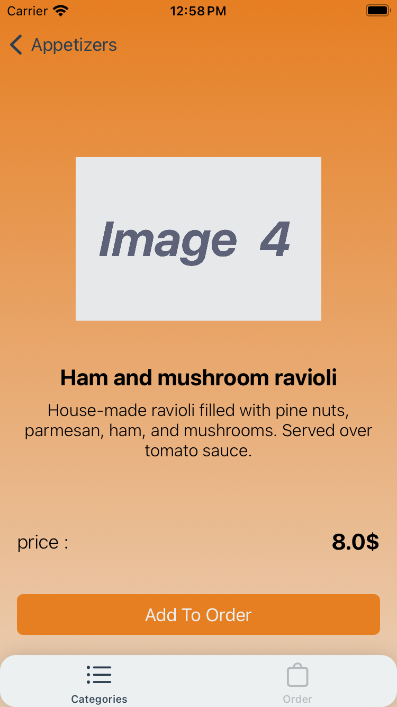
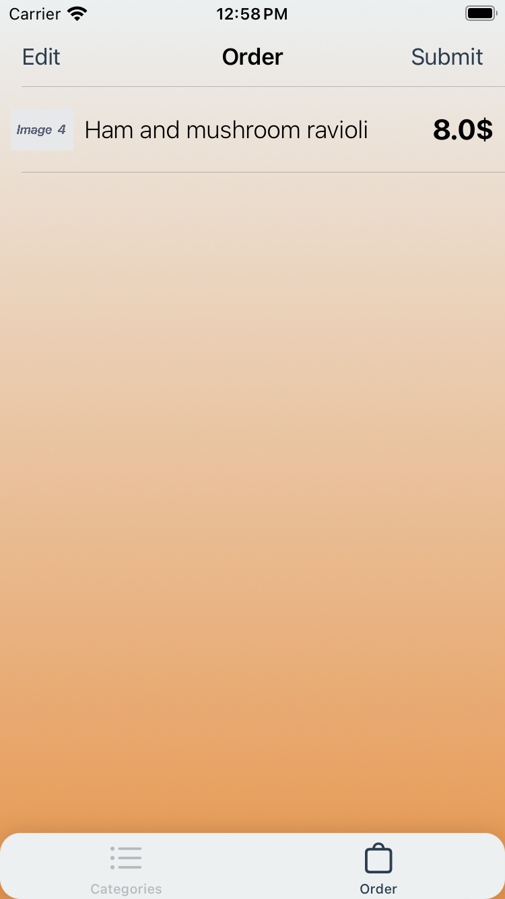
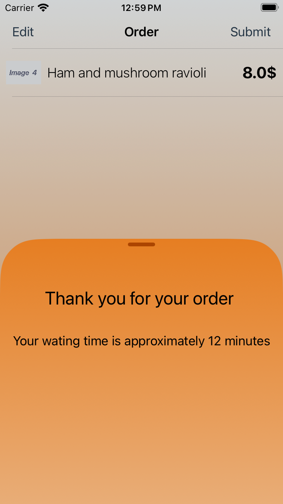

# Easy Menu

## Overview
This app is designed to facilitate order management for a restaurant using a LocalHost server. It enables users to browse available items, create an order, review it, and submit it. Additionally, the app leverages UserDefaults to save and persist order data locally, providing a user experience with Animation.

## Features
- Display a List of available items using **LocalHost** Server 
- Add items to an order
- Display the current order
- Submit the order
- Save order with UserDefaults

## Screenshots
### Here is a screenshots of the main app interface:

  
  

  <em>Menu Screen"</em> &nbsp;&nbsp;&nbsp;&nbsp;&nbsp;&nbsp;&nbsp;&nbsp;
  <em>MenuDetails Screen</em>

  
  

  <em>OrderVC Screen</em> &nbsp;&nbsp;&nbsp;&nbsp;&nbsp;&nbsp;&nbsp;&nbsp;
  <em>Order Submited Screen</em>

## Usage
1. **Display Available Items:** When the app is launched, it automatically fetches a list of available items from the LocalHost server and displays them in an easy-to-navigate TableView for browsing.
2. **Add Items to an Order:** Tap on any item in the list to add it to your current order. You can add multiple items, and the order view controller is updated accordingly.
3. **Submit the Order:** Once you're satisfied with your order, tap the "Submit" button in navigaton bar to finalize and send your order to the LocalHost server for processing.

## Contact
For any inquiries, feel free to reach out to [Abedelrahman Atallah](mailto:aratallah3@gmail.com).
